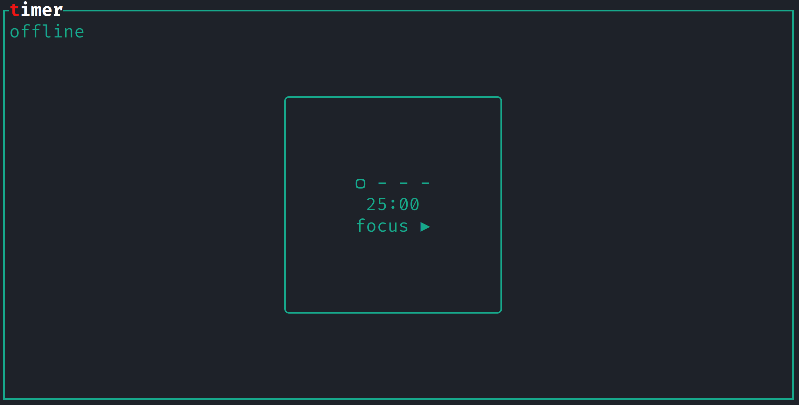

# corrodoro



`corrodoro` is a terminal-ui pomodoro timer written in [Rust](https://www.rust-lang.org/). It can be used offline, but can also host a server to which clients can connect, so you can focus together with your friends.

## Usage
```sh
corrodoro --help
```

## Installation
```sh
cargo install corrodoro
```
