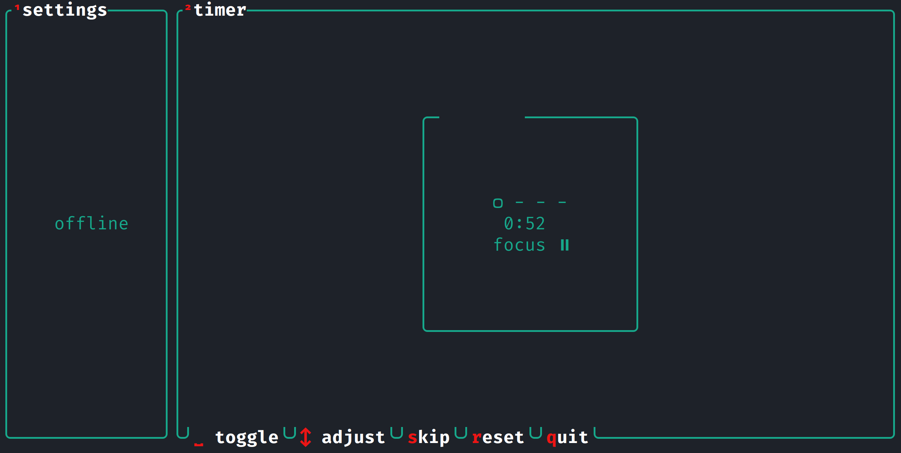

# corrodoro

`corrodoro` is a terminal-ui pomodoro timer written in [Rust](https://www.rust-lang.org/). It can be used offline, but can also host a server to which clients can connect, so you can focus together with your friends.

There is no legend yet, so here are the keybindings:

| input       | action        |
| ----------- | ------------- |
| space       | toggle timer  |
| s           | skip activity |
| mouse wheel | change time   |
| q           | quit          |
